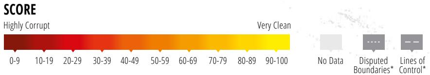
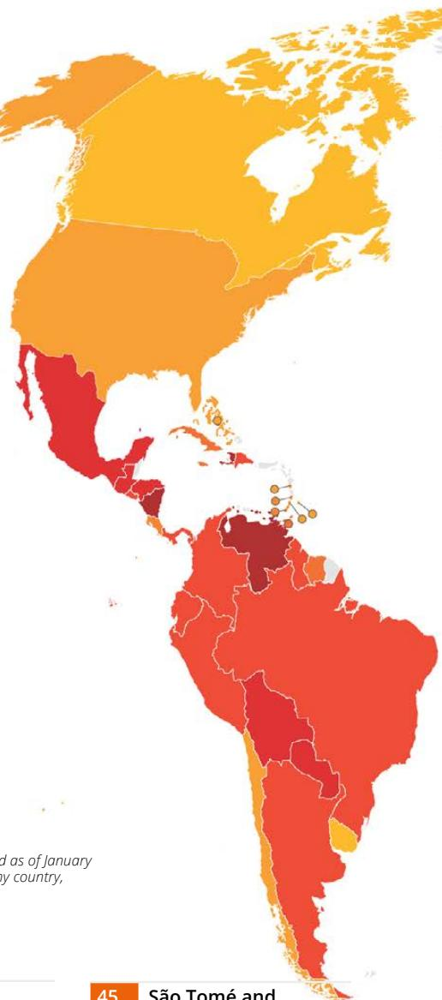
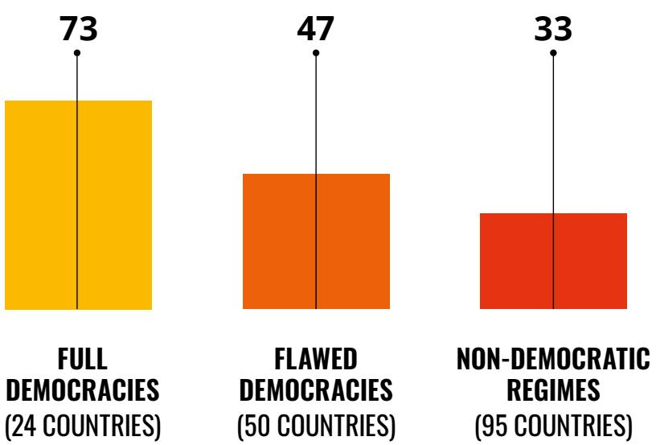
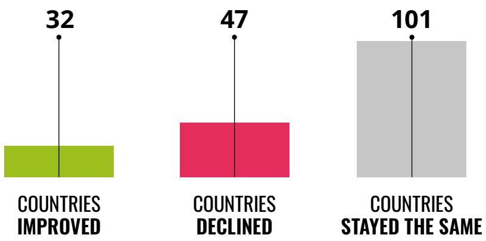
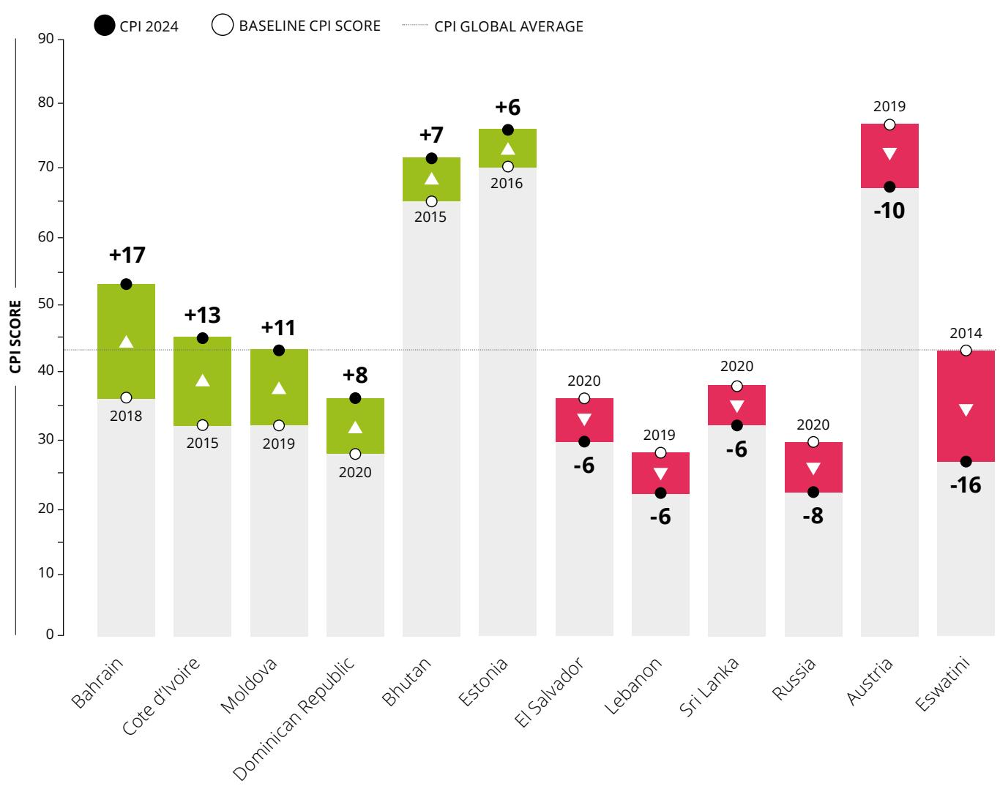
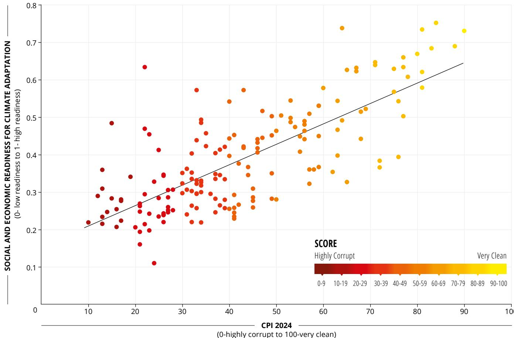
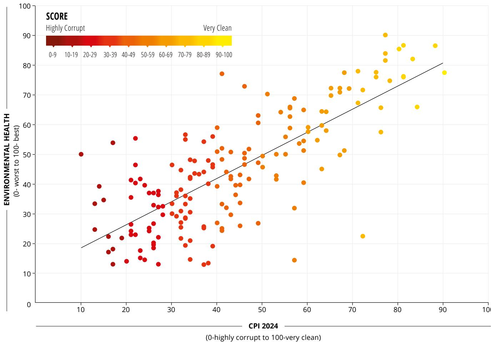
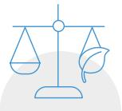
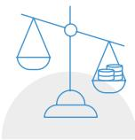

# TRANSPARENCY

# INTERNATIONAL STOP RF R STOPUNDUE

Transparency International is a global movement with one vision: a world in which government, business, civil society and the daily lives of people are free of corruption. With more than 100 chapters worldwide and an international secretariat in Berlin, we are leading the fight against corruption to turn this vision into reality.

www.transparency.org

Cover: Aleksandar Savić / Transparency International.

Every effort has been made to verify the accuracy of the information contained in this report. All information is correct up until February 2025. Nevertheless, Transparency International cannot accept responsibility for the consequences of its use for other purposes or in other contexts.

ISBN: 978-3-96076-266-9

2025 Transparency International. Except where otherwise noted, this work is licensed under CC BY-ND 4.0 DE. Quotation permitted. Please contact Transparency International – copyright@transparency.org – regarding derivatives requests.

# CORRUPTION PERCEPTIONS INDEX 2024

4-5 Map and Results

6-7 Executive Summary

8 Recommendations

9-10 Global Highlights

11-16 Corruption and the Climate Crisis

17 Regional Analyses

1. Undue influence on climate policies and decision-making 2. Embezzlement and misuse of climate funds 3. Weak environmental protection 4. Threats to activists

18 Methodology

19 Endnotes

# 180 COUNTRIES 180 SCORES HOW DOES YOUR COUNTRY MEASURE UP?

The perceived levels of public sector corruption in 180 countries and territories around the world.

  
\*The designations employed and the presentation of material on this map follow the UN practice to the best of our knowledge and as of January 2025. They do not imply the expression of any opinion on the part of Transparency International concerning the legal status of any country, territory, city or area or of its authorities or concerning the delimitation of its frontiers or boundaries.

SCORE COUNTRY/TERRITORY   

<table><tr><td>90</td><td>Denmark</td></tr><tr><td>88</td><td>Finland</td></tr><tr><td>84</td><td> Singapore</td></tr><tr><td>83</td><td>New Zealand</td></tr><tr><td>81</td><td>Luxembourg</td></tr><tr><td>81</td><td>Norway</td></tr><tr><td>81</td><td>Switzerland</td></tr><tr><td>80</td><td>Sweden</td></tr><tr><td>78</td><td>Netherlands</td></tr><tr><td>17</td><td> Australia</td></tr><tr><td>77</td><td>Iceland</td></tr><tr><td>17</td><td>Ireland</td></tr><tr><td>76</td><td>Estonia</td></tr><tr><td>76</td><td>Uruguay</td></tr><tr><td>5</td><td>Canada</td></tr><tr><td></td><td>Germany</td></tr><tr><td>74</td><td>Hong Kong</td></tr><tr><td>72</td><td>Bhutan</td></tr><tr><td>72</td><td>Seychelles</td></tr><tr><td>71</td><td>Japan</td></tr><tr><td>71</td><td>United Kingdom</td></tr><tr><td>69</td><td>Belgium</td></tr><tr><td>68</td><td>Barbados</td></tr></table>

<table><tr><td rowspan=1 colspan=1>68</td><td rowspan=1 colspan=1>United Arab Emirates</td></tr><tr><td rowspan=1 colspan=1>67</td><td rowspan=1 colspan=1>Austria</td></tr><tr><td rowspan=1 colspan=1>67</td><td rowspan=1 colspan=1>France</td></tr><tr><td rowspan=1 colspan=1>67</td><td rowspan=1 colspan=1>Taiwan</td></tr><tr><td rowspan=1 colspan=1>65</td><td rowspan=1 colspan=1>Bahamas</td></tr><tr><td rowspan=1 colspan=1>65</td><td rowspan=1 colspan=1>United States</td></tr><tr><td rowspan=1 colspan=1>64</td><td rowspan=1 colspan=1>Israel</td></tr><tr><td rowspan=1 colspan=1>64</td><td rowspan=1 colspan=1>Korea, South</td></tr><tr><td rowspan=1 colspan=1>63</td><td rowspan=1 colspan=1>Chile</td></tr><tr><td rowspan=1 colspan=1>63</td><td rowspan=1 colspan=1>Lithuania</td></tr><tr><td rowspan=1 colspan=1>63</td><td rowspan=1 colspan=1>Saint Vincent and theGrenadines</td></tr><tr><td rowspan=1 colspan=1>62</td><td rowspan=1 colspan=1>Cabo Verde</td></tr><tr><td rowspan=1 colspan=1>60</td><td rowspan=1 colspan=1>Dominica</td></tr><tr><td rowspan=1 colspan=1>60</td><td rowspan=1 colspan=1>Slovenia</td></tr><tr><td rowspan=1 colspan=1>59</td><td rowspan=1 colspan=1>Latvia</td></tr><tr><td rowspan=1 colspan=1>59</td><td rowspan=1 colspan=1>Qatar</td></tr><tr><td rowspan=1 colspan=1>59</td><td rowspan=1 colspan=1>Saint Lucia</td></tr><tr><td rowspan=1 colspan=1>59</td><td rowspan=1 colspan=1>Saudi Arabia</td></tr><tr><td rowspan=1 colspan=1>58</td><td rowspan=1 colspan=1>Costa Rica</td></tr><tr><td rowspan=1 colspan=1>57</td><td rowspan=1 colspan=1>Botswana</td></tr><tr><td rowspan=1 colspan=1>57</td><td rowspan=1 colspan=1>Portugal</td></tr><tr><td rowspan=1 colspan=1>57</td><td rowspan=1 colspan=1>Rwanda</td></tr><tr><td rowspan=1 colspan=1>56</td><td rowspan=1 colspan=1>Cyprus</td></tr></table>

<table><tr><td rowspan=1 colspan=1>45</td><td rowspan=1 colspan=1> Sao Tomé andPrincipe</td></tr><tr><td rowspan=1 colspan=1>45</td><td rowspan=1 colspan=1>Senegal</td></tr><tr><td rowspan=1 colspan=1>44</td><td rowspan=1 colspan=1>Jamaica</td></tr><tr><td rowspan=1 colspan=1>44</td><td rowspan=1 colspan=1>Kosovo</td></tr><tr><td rowspan=1 colspan=1>44</td><td rowspan=1 colspan=1>Timor-Leste</td></tr><tr><td rowspan=1 colspan=1>43</td><td rowspan=1 colspan=1>Bulgaria</td></tr><tr><td rowspan=1 colspan=1>43</td><td rowspan=1 colspan=1>China</td></tr><tr><td rowspan=1 colspan=1>43</td><td rowspan=1 colspan=1>Moldova</td></tr><tr><td rowspan=1 colspan=1>43</td><td rowspan=1 colspan=1>Solomon Islands</td></tr><tr><td rowspan=1 colspan=1>42</td><td rowspan=1 colspan=1>Albania</td></tr><tr><td rowspan=1 colspan=1>42</td><td rowspan=1 colspan=1>Ghana</td></tr><tr><td rowspan=1 colspan=1>41</td><td rowspan=1 colspan=1>Burkina Faso</td></tr><tr><td rowspan=1 colspan=1>41</td><td rowspan=1 colspan=1>Cuba</td></tr><tr><td rowspan=1 colspan=1>41</td><td rowspan=1 colspan=1>Hungary</td></tr><tr><td rowspan=1 colspan=1>41</td><td rowspan=1 colspan=1> South Africa</td></tr><tr><td rowspan=1 colspan=1>41</td><td rowspan=1 colspan=1>Tanzania</td></tr><tr><td rowspan=1 colspan=1>41</td><td rowspan=1 colspan=1>Trinidad and Tobago</td></tr><tr><td rowspan=1 colspan=1>40</td><td rowspan=1 colspan=1> Kazakhstan</td></tr><tr><td rowspan=1 colspan=1>40</td><td rowspan=1 colspan=1>North Macedonia</td></tr><tr><td rowspan=1 colspan=1>40</td><td rowspan=1 colspan=1>Suriname</td></tr><tr><td rowspan=1 colspan=1>40</td><td rowspan=1 colspan=1>Vietnam</td></tr><tr><td rowspan=1 colspan=1>39</td><td rowspan=1 colspan=1>Colombia</td></tr><tr><td rowspan=1 colspan=1>39</td><td rowspan=1 colspan=1>Guyana</td></tr></table>

<table><tr><td rowspan=1 colspan=1>39</td><td rowspan=1 colspan=2>Tunisia</td><td rowspan=1 colspan=2></td><td rowspan=1 colspan=1></td><td rowspan=1 colspan=1>33</td></tr><tr><td rowspan=2 colspan=1>39</td><td rowspan=3 colspan=2> ZambiaGambia</td><td rowspan=2 colspan=2></td><td rowspan=2 colspan=1>33</td><td rowspan=2 colspan=1> Panama</td></tr><tr><td rowspan=1 colspan=2></td></tr><tr><td rowspan=1 colspan=1>38</td><td rowspan=1 colspan=2></td><td rowspan=1 colspan=1>33</td><td rowspan=1 colspan=1>Philippines</td></tr><tr><td rowspan=1 colspan=1>38</td><td rowspan=1 colspan=2>India</td><td rowspan=1 colspan=2></td><td rowspan=1 colspan=1>33</td><td rowspan=1 colspan=1>Sierra Leone</td></tr><tr><td rowspan=2 colspan=1>38</td><td rowspan=3 colspan=2>MaldivesArgentina</td><td rowspan=1 colspan=2></td><td rowspan=2 colspan=1></td><td rowspan=2 colspan=1>32</td></tr><tr><td rowspan=1 colspan=2></td></tr><tr><td rowspan=1 colspan=1>37</td><td rowspan=1 colspan=2></td><td rowspan=1 colspan=1>32</td><td rowspan=1 colspan=1>Ecuador</td></tr><tr><td rowspan=1 colspan=1>37</td><td rowspan=1 colspan=2>Ethiopia</td><td rowspan=1 colspan=2></td><td rowspan=1 colspan=1>32</td><td rowspan=1 colspan=1>Kenya</td></tr><tr><td rowspan=2 colspan=1>37</td><td rowspan=2 colspan=2> Indonesia</td><td></td><td></td><td></td><td></td></tr><tr><td rowspan=1 colspan=2></td><td rowspan=1 colspan=1>32</td><td rowspan=1 colspan=1>Sri Lanka</td></tr><tr><td rowspan=1 colspan=1>37</td><td rowspan=1 colspan=2>Lesotho</td><td rowspan=1 colspan=2></td><td rowspan=1 colspan=1>32</td><td rowspan=1 colspan=1>Togo</td></tr><tr><td rowspan=1 colspan=1>37</td><td rowspan=1 colspan=2>Morocco</td><td rowspan=1 colspan=2></td><td rowspan=1 colspan=1>32</td><td rowspan=1 colspan=1>Uzbekistan</td></tr><tr><td rowspan=1 colspan=1>36</td><td rowspan=1 colspan=2>Dominican Republic</td><td rowspan=1 colspan=2></td><td rowspan=1 colspan=1>31</td><td rowspan=1 colspan=1>Djibouti</td></tr><tr><td rowspan=1 colspan=1>35</td><td rowspan=7 colspan=2>SerbiaUkraineAlgeriaBrazilMalawi</td><td rowspan=1 colspan=2></td><td rowspan=1 colspan=1>31</td><td rowspan=1 colspan=1>Papua New Guinea</td></tr><tr><td rowspan=3 colspan=1>35</td><td></td><td></td><td></td><td></td></tr><tr><td rowspan=5 colspan=2></td><td></td><td></td></tr><tr><td rowspan=1 colspan=1>31</td><td rowspan=1 colspan=1>Peru</td></tr><tr><td rowspan=1 colspan=1>34</td><td rowspan=1 colspan=1>30</td><td rowspan=1 colspan=1>Egypt</td></tr><tr><td rowspan=1 colspan=1>34</td><td rowspan=1 colspan=1>30</td><td rowspan=1 colspan=1>El Salvador</td></tr><tr><td rowspan=1 colspan=1>34</td><td rowspan=1 colspan=1>30</td><td rowspan=1 colspan=1>Mauritania</td></tr><tr><td rowspan=1 colspan=1>34</td><td rowspan=4 colspan=2>NepalNigerThailand</td><td rowspan=1 colspan=2></td><td rowspan=1 colspan=1></td><td rowspan=1 colspan=1>28</td></tr><tr><td rowspan=2 colspan=1>34</td><td></td><td></td><td></td><td></td></tr><tr><td rowspan=1 colspan=2></td><td rowspan=1 colspan=1>28</td><td rowspan=1 colspan=1>Guinea</td></tr><tr><td rowspan=1 colspan=1>34</td><td rowspan=1 colspan=2></td><td rowspan=1 colspan=1>27</td><td rowspan=1 colspan=1>Eswatini</td></tr><tr><td rowspan=2 colspan=1>34</td><td rowspan=5 colspan=2>TurkeyBelarusBosnia andHerzegovina</td><td rowspan=2 colspan=2></td><td rowspan=2 colspan=1>27</td><td rowspan=2 colspan=1>Gabon</td></tr><tr><td rowspan=4 colspan=2></td></tr><tr><td rowspan=1 colspan=1>33</td><td rowspan=1 colspan=1>27</td><td rowspan=1 colspan=1>Liberia</td></tr><tr><td rowspan=2 colspan=1>33</td><td rowspan=1 colspan=1>27</td><td rowspan=1 colspan=1>Mali</td></tr><tr><td rowspan=1 colspan=2></td><td rowspan=1 colspan=1>27</td><td rowspan=1 colspan=1>Pakistan</td></tr><tr><td rowspan=1 colspan=1>33</td><td rowspan=1 colspan=2>Laos</td><td></td><td rowspan=1 colspan=1></td><td rowspan=1 colspan=1>26</td><td rowspan=1 colspan=1>Cameroon</td></tr></table>

<table><tr><td rowspan=1 colspan=1>20</td><td rowspan=1 colspan=1>Democratic Republicof the Congo</td></tr><tr><td rowspan=1 colspan=1>19</td><td rowspan=1 colspan=1>Tajikistan</td></tr><tr><td rowspan=1 colspan=1>17</td><td rowspan=1 colspan=1> Afghanistan</td></tr><tr><td rowspan=1 colspan=1>17</td><td rowspan=1 colspan=1>Burundi</td></tr><tr><td rowspan=1 colspan=1>17</td><td rowspan=1 colspan=1>Turkmenistan</td></tr><tr><td rowspan=1 colspan=1>16</td><td rowspan=1 colspan=1>Haiti</td></tr><tr><td rowspan=1 colspan=1>16</td><td rowspan=1 colspan=1>Myanmar</td></tr><tr><td rowspan=1 colspan=1>15</td><td rowspan=1 colspan=1>Korea, North</td></tr><tr><td rowspan=1 colspan=1>15</td><td rowspan=1 colspan=1>Sudan</td></tr><tr><td rowspan=1 colspan=1>14</td><td rowspan=1 colspan=1> Nicaragua</td></tr><tr><td rowspan=1 colspan=1>13</td><td rowspan=1 colspan=1> Equatorial Guinea</td></tr><tr><td rowspan=1 colspan=1>13</td><td rowspan=1 colspan=1>Eritrea</td></tr><tr><td rowspan=1 colspan=1>13</td><td rowspan=1 colspan=1>Libya</td></tr><tr><td rowspan=1 colspan=1>13</td><td rowspan=1 colspan=1>Yemen</td></tr><tr><td rowspan=1 colspan=1>12</td><td rowspan=1 colspan=1>syria</td></tr><tr><td rowspan=1 colspan=1>10</td><td rowspan=1 colspan=1>Venezuela</td></tr><tr><td rowspan=1 colspan=1>9</td><td rowspan=1 colspan=1>Somalia</td></tr><tr><td rowspan=1 colspan=1>：</td><td rowspan=1 colspan=1> South Sudan</td></tr></table>

# EXECUTIVE SUMMARY

Two of the biggest challenges humanity faces are strongly intertwined: corruption and the climate crisis. While billions of people around the world face the daily consequences of climate change, resources for adaptation and mitigation remain woefully inadequate. Corruption intensifies these challenges, posing additional threats to vulnerable communities.

A lack of adequate transparency and accountability mechanisms increases the risk that climate funds may be misused or embezzled. What is more, climate corruption can also take the form of undue influence, revolving doors between the public and private sectors, and regulatory capture by private actors. These factors have obstructed adoption of the ambitious policies and measures needed to address climate change, favouring the interests of narrow groups over the common good. The corruption crisis is a huge obstacle to solving the climate crisis.

As corruption grows in scale and complexity, over two thirds of countries now score below the mid-point on Transparency International’s Corruption Perceptions Index (CPI) – with huge and potentially devastating implications for global climate action. Corruption weakens governance structures, undermines law enforcement and diverts critical climate finance intended to reduce emissions and build resilience. In nations where corruption is pervasive, transparency in environmental decision-making is often compromised, leading to unfair outcomes and the destruction of natural resources.

Even in countries with relatively low perceived corruption, the influence of lobbying presents additional challenges. Powerful corporate interests often shape or block climate policies to favour short-term profits over long-term environmental sustainability. This leads to watered-down regulations, delays in the transition to renewable energy, and insufficient action to meet international climate commitments.

2/3 OF 50/ COUNTRIES SCORE BELOW 100

Corruption can also deepen the marginalisation of vulnerable populations who suffer disproportionately from the negative effects of climate change. Ensuring the inclusive design and implementation of climate initiatives, grounded in public participation, is crucial to enhancing the environmental and social outcomes of climate action. Without robust national anti-corruption measures, the effectiveness of global climate agreements such as the Paris Agreement remains at risk, further jeopardising efforts to combat the climate crisis.

# AVERAGE CPI 2024 SCORE FOR DIFFERENT TYPES OF GOVERNMENT\*

Strong democracies vastly outperform flawed ones and authoritarian regimes in control of corruption.

  
\* Based on the Economist Intelligence Unit's (EIU) democracy classification for the year 2023. The total number of countries covered here is lower than the number covered by the CPI, as the EIU does not provide data for 13 of the countries in our sample. Data available at: https://ourworldindata.org/grapher/political-regime-eiu.

Corruption is an evolving global threat that does far more than undermine development – it is a key cause of declining democracy, instability and human rights violations. The international community and every nation must make tackling corruption a top and long-term priority. This is crucial to pushing back against authoritarianism and securing a peaceful, free and sustainable world. The dangerous trends revealed in this year’s Corruption Perceptions Index highlight the need to follow through with concrete action now to address global corruption.

François Valérian Chair, Transparency International

# RECOMMENDATIONS

To effectively combat the climate crisis, we must place corruption at the centre of the global debate. Governments, international organisations and businesses must prioritise the integration of robust anti-corruption measures into climate finance, policies and projects. Transparency and accountability are essential to ensuring resources are protected, policies deliver on their objectives, and projects reach the communities that need them most. Addressing corruption head-on will rebuild societies’ trust in climate initiatives and drive progress toward a sustainable world.

# PUT INTEGRITY AT THE CENTRE OF CLIMATE EFFORTS. THIS IS KEY TO ACHIEVING REAL IMPACT.

Anti-corruption measures can enhance countries’ ability to mitigate and adapt to the climate crisis. As the climate field is still developing, there is a unique chance to establish safeguards against theft, policy capture and other abuse. Strong collaboration between climate and anti-corruption actors is essential, with the United Nations (UN) Convention against Corruption offering a critical framework to support this work.

# ENHANCE INVESTIGATIONS, SANCTIONS AND PROTECTIONS TO COMBAT CORRUPTION. THIS WILL DETER ENVIRONMENTAL CRIMES AND REDUCE IMPUNITY.

Access to justice can be improved through strengthening enforcement and oversight bodies – including anti-corruption bodies. Local communities need access to grievance mechanisms, while those who speak out – climate, land and environmental defenders, and whistleblowers – must be protected from all forms of retaliation.

# SHIELD CLIMATE POLICYMAKING PROCESSES FROM UNDUE INFLUENCE AT NATIONAL, REGIONAL AND INTERNATIONAL LEVELS. THIS WILL LEAD TO STRONGER CLIMATE ACTION.

# STRENGTHEN CITIZEN ENGAGEMENT IN CLIMATE INVESTMENTS. THIS WILL ENABLE THOSE AFFECTED BY THE CLIMATE CRISIS TO HELP TAILOR THE SOLUTIONS.

Reaching the highest levels of transparency and inclusivity in climate policies and finance allocation would unlock their full potential, while also reestablishing trust in climate initiatives. Creating mechanisms to detect and manage conflicts of interest – including through lobbying registers and declarations of interests – is essential to raise ambition in key climate fora such as the UN Framework Convention against Climate Change.

Information on climate finance, projects and contracts needs to be open, accessible and disseminated in a timely way, in line with the principles of obtaining free, prior and informed consent from people affected by such initiatives. Inclusive accountability frameworks ensure communities are engaged throughout initiatives like the Just Energy Transition Partnerships between countries, including via oversight. This produces results that better address their needs.

# GLOBAL HIGHLIGHTS

Corruption affects billions of people worldwide, destroying lives, undermining human rights and exacerbating global crises. It blocks real action where it’s needed most – stalling critical policies, enabling impunity, and fuelling inequalities.

Backed by sophisticated international moneylaundering networks, large-scale corruption empowers autocrats, illicitly enriches private actors and weakens democracy everywhere. No nation is immune, and ignoring corruption comes at a cost we can no longer afford. Every country has a role to play in stopping it.

The CPI ranks 180 countries and territories according to the levels of public-sector corruption perceived by experts and businesspeople. It relies on 13 independent data sources and uses a scale of zero to 100, where zero is highly corrupt and 100 is very clean.

The CPI highlights the stark contrast between nations with strong, independent institutions and free, fair

elections, and those with repressive authoritarian regimes. Full democracies have a CPI average of 73, while flawed democracies average 47 and non-democratic regimes just 33. This highlights that although some nondemocratic countries might be perceived as managing certain forms of corruption, the broader picture shows that democracy and strong institutions are crucial for combatting corruption fully and effectively.

Similarly, countries where civic space is guaranteed and protected tend to control corruption better. Those where the freedoms of expression, assembly and association are duly safeguarded tend to score relatively well on the CPI, while those lacking these freedoms largely have very low scores.1

# CPI SCORE CHANGES, 2012-2024

Number of countries that the underlying data sources largely agree improved or declined over the period 2012 to 2024, for all 180 countries with data available.

For the seventh year in a row, Denmark heads the ranking, with a score of 90. Finland and Singapore take the second and third spots, with scores of 88 and 84, respectively. Scoring 83, New Zealand is out of the top three positions for the first time since 2012, but it remains in the top 10, together with Luxembourg (81), Norway (81), Switzerland (81), Sweden (80), the Netherlands (78), Australia (77), Iceland (77) and Ireland (77).

Meanwhile, countries experiencing conflict or with highly restricted freedoms and weak democratic institutions occupy the bottom of the index. South Sudan (8), Somalia (9) and Venezuela (10) take the last three spots. Syria (12), Equatorial Guinea (13), Eritrea (13), Libya (13), Yemen (13), Nicaragua (14), Sudan (15) and North Korea (15) complete the list of lowest scorers.

# MOST SIGNIFICANT MOVERS

These are countries that the underlying data sources largely agree improved or declined over the period 2015 to 2024. A full list of all statistically significant changes is available in the CPI 2024 dataset.2

# CORRUPTION AND THE CLIMATE CRISIS

The climate crisis is one of the most pressing challenges of our time, driven by a web of interconnected factors. Among them lies a crucial but often overlooked issue: corruption, which undermines climate action by misdirecting resources, enabling harmful practices and stifling progress. The CPI shows that corruption is a global problem, affecting every country and obstructing efforts to properly confront climate change. Corruption contributes to the climate crisis in several ways.

# 1. UNDUE INFLUENCE ON CLIMATE POLICIES AND DECISION-MAKING

By undermining the development and enforcement of critical climate and environmental policies, corruption obstructs efforts to implement stringent regulations, reduce emissions and promote clean energy initiatives.

For decades, lobbyists from powerful industries – especially fossil fuel companies and car manufacturers3 – have unduly influenced politicians to derail efforts to reduce greenhouse gas emissions. This policy capture, combined with decision-makers having conflicts of

interest and moving through revolving doors between public- and private-sector jobs, creates significant barriers to meaningful climate governance worldwide.

Undue influence on climate policy occurs in countries with both high and low corruption levels. However, it is in wealthy, developed countries that this interference undermines global progress the most. These nations hold the greatest responsibility to lead on ambitious climate goals, reduce emissions at scale and build resilience worldwide. When undue influence distorts their policies, it delays critical actions, weakens international cooperation and hampers the global fight against the climate crisis.

We must urgently root out corruption before it fully derails meaning climate action. Governments and multilateral organisations must embed anti-corruption measures into climate efforts to safeguard finance, rebuild trust, and maximise impact. Today, corrupt forces not only shape but often dictate policies and dismantle checks and balances – silencing journalists, activists, and anyone fighting for equality and sustainability. True climate resilience demands tackling these threats directly and decisively. Vulnerable people around the world desperately need this action.

Maíra Martini CEO, Transparency International

# FIGURE 1: CORRUPTION AND READINESS TO ADAPT TO CLIMATE CHANGE

Countries with lower corruption levels generally show better readiness to face the challenges posed by climate change. However, that is not enough – many are still not adopting the ambitious measures necessary to tackle the climate crisis, due in part to undue influence by businesses.

  
Source: Notre Dame Global Adaptation Initiative Country Index (ND-GAIN, 2024) and Transparency International Corruption Perceptions Index 2024 (2025)

SOUTH AFRICA (41) shows a worrying trend, dropping by three points since 2019. In 2025, the country will host the G20 Leaders’ Summit, giving it a vital opportunity to advocate for increased climate finance commitments from G20 countries that do not conflate debt repayments, private financing and loans as a substitute for direct mechanisms to mitigate the climate crisis. South Africa must strengthen oversight mechanisms to ensure that domestic corruption does not interfere with such crucial international processes, as has happened at past summits.

IN THE UNITED STATES (65), a major energy company orchestrated a US\$60 million bribery scheme to unduly influence public policy in its favour and slow a transition to renewable energy. The prosecutors argue that the company funnelled money to a politician – who maintains his innocence – and his associates so they would push through a billion-dollar bailout of two nuclear power plants. Reportedly, this helped the company to compete with newer, cheaper forms of energy and gain a competitive advantage.

# 2. EMBEZZLEMENT AND MISUSE OF CLIMATE FUNDS

Corruption threatens the funding allocated to mitigate and adapt to the effects of global heating. While the amount currently invested in mitigation and adaptation measures is just a fraction of what the United Nations (UN) estimates is needed to face this challenge, corruption – aided by lack of transparency – can undermine the effectiveness of these funds by diverting them from their intended purpose. There is also a worrying lack of metrics and frameworks for climate transparency and accountability, allowing some countries to be vague around their commitments: this can provide opportunities for corruption, as little information is available about the actual funds disbursed and the projects carried out.

Very often,the countries that need this money the most, also tend to struggle to control corruption. By mainstreaming transparency and anti-corruption provisions into the management frameworks for such funds, stakeholders can help maximise their impact.

In particular, safeguarding climate mitigation and adaptation initiatives from corruption can make them more effective and beneficial for the most vulnerable groups. Marginalised people usually have fewer options for adapting to extreme weather and pollution, leaving them most in need of government support. However, as corruption diverts much-needed funds into private pockets, these groups often remain particularly exposed to the effects of climate change caused by inadequate infrastructure, poor disaster preparedness and other forms of neglect.

# 3. WEAK ENVIRONMENTAL PROTECTION

Corruption severely undermines the enforcement of environmental laws and policies, by weakening regulatory oversight. Bribery and kickbacks can lead public officials, law enforcement, customs agents, harbour authorities, licensing bodies and regulators to either overlook environmental violations or actively benefit from them.6

Combatting corruption is therefore essential to ensuring that existing environmental regulations are enforced, preventing harmful practices and unsustainable resource exploitation. It is also vital in the fight against environmental crime – now the fourthlargest form of organised crime, generating annual profits for criminal networks estimated at between $\cup S \$ 82$ billion and $\cup \Sigma \$ 238$ billion.7

# FIGURE 2: CORRUPTION AND ENVIRONMENTAL HEALTH

While environmental protection is a multi-faceted phenomenon with many contributing factors, countries with better control of corruption tend to perform better at preserving their environments.

  
Source: Environmental Performance Index (2024) and Transparency International Corruption Perceptions Index 2024 (2025)

IN RUSSIA (22), an audit found strong indications that millions of dollars were misappropriated from a project funded by the Global Environment Facility and managed by the UN Development Programme (UNDP), which aimed to reduce emissions by strengthening energy efficiency standards. The project – which ran from 2010 to 2017 – reportedly failed to meet any of its emissions reduction targets.

DENMARK (90), the highest-ranking country on the CPI, is also seen as one of the most prepared for tackling the effects of climate change. Recognising the importance of addressing climate risks, thec country adopted its first national adaptation strategy in 2008. This was followed in by a national action plan in 2012, which highlights the vital role of local actors – including municipalities, businesses and individuals – in driving adaptation efforts. Today, 95 of Denmark’s 98 municipalities have climate action plans aligned with the Paris Agreement. Climate policymaking, however, is subject to the same structural challenges as other high-profile policy areas, including the risks of lobbying influence and a lack of transparency in the decisionmaking process.

# 4. THREATS TO ACTIVISTS

Corruption makes it harder for people to speak out against climate change. Land and environmental defenders – who are frequently at the forefront of the fight against the climate crisis – are particularly exposed to violence, intimidation and even murder in countries where corruption levels are high. In the last five years, more than 1,000 environmental defenders have been killed, almost all of them in countries with CPI scores below 50.

In short, we cannot solve the climate crisis unless we step up the fight against corruption – and increasingly frequent and severe environmental degradation, natural disasters and climate-related instability show we must act now.

# FIGURE 3: CORRUPTION AND MURDER OF ENVIRONMENTAL DEFENDERS

Environmental defenders are at far higher risk of violence, intimidation and murder in countries with high corruption levels. Almost all of the 1,013 murders of environmental defenders since 2019 took place in countries with CPI scores below 50.

1 enviromental defender killed

This year’s analysis showed again how fossil fuel corruption undermines climate efforts, including in the United States. Around the world, communities are demanding climate action from their governments. But the people’s voices are time and again countered by the corrupting power of the oil and gas companies profiting from environmental devastation,

who use their billions to attempt to silence critics and activists, to buy power, and to dismantle the protections that safeguard our families and our planet. Greenpeace organisations and our allies are facing such a threat from pipeline giant Energy Transfer, which is trying to wipe us off the map in the US with a massive, specious lawsuit. It’s up to all of us who care about the future to stand up to these corporate bullies, no matter the cost.

Mads Christensen Executive Director Greenpeace International

Photo: Tim Aubry / Greenpeace

LIBYA (13) faces acute vulnerabilities to climate change, including extreme heat, dwindling rainfall, rising sea levels and prolonged droughts. These challenges are compounded by widespread corruption and the absence of a cohesive adaptation strategy, deepening the country’s instability. In 2023, Storm Daniel caused catastrophic flooding, killing over 11,000 people, according to Libyan authorities. The disaster, which swept away entire neighbourhoods, was partly attributed to poorly maintained infrastructure, including two dams that collapsed due to corruption and neglect.

VIETNAM (40) illustrates how systemic corruption, extending from lower level to high-ranking public officials, drives environmental destruction and forest degradation. Bribes and kickbacks to senior Vietnamese officials, alongside customs and border personnel, have facilitated the smuggling of illegally harvested Cambodian timber into Vietnam and laundering of it into the legal market.

# REGIONAL ANALYSES

Corruption and efforts to fight it take various forms and have different trends around the world. From the Americas to the Middle East and the Pacific, each region has its own causes for concern – and also optimism – with countries following various trajectories in the struggle for integrity. Our regional analyses provide overviews of the key corruption topics and hot-spots in each region, signposting the main things to know if you want to stop corruption in those places.

# THE AMERICAS

Corruption fuels environmental crime and impunity across the region

The absence of effective anticorruption measures promotes human rights violations, and increases the influence of elites and organised crime on policy-making.

# ASIA PACIFIC

Leaders failing to stop corruption amid an escalating climate crisis

In the region most prone to natural disasters, governments across Asia Pacific are still not delivering on anti-corruption pledges.

# EASTERN EUROPE & CENTRAL

# ASIA

Vicious cycle of weak democracy and flourishing corruption

Weak democratic institutions and rule of law are exacerbated by ongoing instability and external pressures.

# MIDDLE EAST &

# NORTH AFRICA

Corruption linked to authoritarianism, but calls for reform emerging

Stagnation stems mostly from nearabsolute control by political leaders, who benefit from the wealth they direct toward themselves, clamping down on any dissent to maintain their power.

# SUB-SAHARAN AFRICA

Weak anti-corruption measures undermine climate action

Amid a very low regional performance in 2024, there were African countries that invested in anti-corruption and made remarkable progress.

# WESTERN EUROPE & EUROPEANUNION

Leaders’ hollow efforts cause worsening corruption levels

In fragile times, anti-corruption efforts are falling short. This is hindering the region’s response to the climate crisis and other challenges, like fraying rule of law and overstrained public services.

# METHODOLOGY

The Corruption Perceptions Index (CPI) aggregates data from a number of different sources that provide perceptions among businesspeople and country experts of the level of corruption in the public sector.

Transparency International takes the following steps to calculate the CPI:

# 2. STANDARDISE DATA SOURCES TO A SCALE OF 0-100

# 1. SELECT DATA SOURCES

Each data source used to construct the CPI must fulfil the following criteria to qualify as valid:

This standardisation is achieved by subtracting the mean of each source in the baseline year from each country score, then dividing by the standard deviation of that source in the baseline year. This subtraction and division using the baseline year parameters ensures that the CPI scores are comparable year on year since 2012. After this procedure, the standardised scores are transformed to the CPI scale by multiplying them with the value of the CPI standard deviation in 2012 (20) and adding the mean of the CPI in 2012 (45), so that the dataset fits the CPI’s 0-100 scale.

quantifies risks or perceptions of corruption in the public sector • is based on a reliable and valid methodology comes from a reputable organisation allows for sufficient variation of scores to distinguish between countries ranks a substantial number of countries considers only the assessments of country experts or businesspeople • is regularly updated.

# 3. CALCULATE THE AVERAGE

For a country or territory to be included in the CPI, it must be assessed by a minimum of three sources. A country’s CPI score is calculated as the average of all standardised scores available for it. Scores are rounded to whole numbers.

The CPI 2024 is calculated using 13 different data sources from 12 different institutions that capture perceptions of corruption within the past two years.

# 4. REPORT THE MEASURE OF UNCERTAINTY

The CPI score is accompanied by a standard error and confidence interval. This captures the variation across the data sources available for a country or territory.

# ENDNOTES

1. Pring, C. J. Vrushi and R. Martinez Barranco Kukutschka (2018). “Digging Deeper into Corruption, Violence against Journalists and Active Civil Society” https://www.transparency.org/en/news/diggingdeeper-into-corruption-violence-against-journalists

2. The CPI 2024 dataset can be found here: https://www.transparency.org/en/cpi/2024

3. Ilaria Schmoland et al., “Pipelines of Power. Big Oil’s Lobbying Footprint on EU Climate Policy” (Transparency International EU, 2024).

4. Barbara Buchner et al., “Global Landscape of Climate Finance $2 0 2 3 "$ , Climate Policy Initiative, November 2023.

5. UNCTAD, “The Costs of Achieving the SDGs: Climate Change”, accessed 28 June 2024, https://unctad.org/ sdg-costing/climate-change.

6. Tanya Wyatt, Daan Van Uhm and Angus Nurse, “Differentiating Criminal Networks in the Illegal Wildlife Trade: Organized, Corporate and Disorganized Crime”, Trends in Organized Crime 23, no. 4 (December 2020): 350–66, https://doi. org/10.1007/s12117-020-09385-9.

7. European Commission, “Environmental Crime Directive”, accessed 28 June 2024, https:// environment.ec.europa.eu/law-and-governance/ environmental-compliance-assurance/ environmental-crime-directive_en.

# ENGAGE

Follow us, share your views and discuss corruption with people from around the world on social media.

Facebook: /transparencyinternational Twitter/X: @anticorruption LinkedIn: @transparency-international Instagram: @Transparency_International YouTube: @TransparencyIntl

# LEARN

Visit our website to learn more about our work in more than 100 countries and sign up for the latest news in the fight against corruption.

transparency.org

# DONATE

Your donation will help us provide support to thousands of victims of corruption, develop new tools and research, and hold governments and businesses to their promises. We want to build a fairer, more just world. With your help, we can.

transparency.org/donate

Transparency International International Secretariat Alt-Moabit 96, 10559 Berlin, Germany

Phone: +49 30 34 38 200 ti@transparency.org www.transparency.org

Blog: transparency.org/blog Facebook: /transparencyinternational Twitter/X: @anticorruption LinkedIn: @transparency-international Instagram: @Transparency_International YouTube: @TransparencyIntl